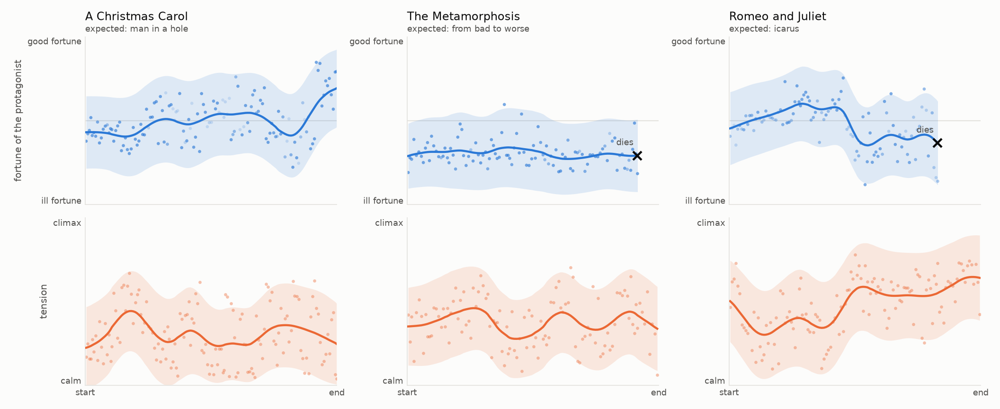

# story-shapes

The shape of a story, read passage by passage by a model that decides instead of writing.

Kurt Vonnegut argued that stories have shapes: plot how things go for the protagonist from the
first page to the last, and a handful of curves keep coming back — *man in a hole*, *from bad to
worse*, *Cinderella*. Researchers have since drawn these curves by scoring the tone of the words
([syuzhet](https://github.com/mjockers/syuzhet);
[Reagan et al., 2016](https://arxiv.org/abs/1606.07772)). But tone is not fortune: a gloomy
paragraph in which the hero wins still reads as a fall.

story-shapes asks the question directly. Every passage of about 200 words goes to
[Kev](https://github.com/jaredpalmer/kev), an open replica of TypeSafe's Jev: a *System One*
model that returns calibrated probabilities instead of text. It answers three questions per
passage: how are things going for the protagonist (five levels), how tense is it (four levels),
and does the protagonist appear.



*First look: three short books read by Kev-4B on a laptop. Dots are passages, the line is a
Gaussian-smoothed average.*

## Status

Early, and measured. Before building anything else, the method was tested against criteria
fixed in advance ([full results](eval/RESULTS.md)):

| Test | Kev-4B | VADER (word list) | Criterion |
|---|---|---|---|
| Passages where tone and fortune disagree | **90 %** right (first wording: 68 %) | 18 % | ≥ 75 % ✅ |
| Controls, where they agree | 100 % | 80 % | both ≥ 85 % ❌ (VADER) |
| Synthetic stories with planned arcs | ρ = 0.94, 12/12 shapes | ρ = 0.70, 7/12 | ρ ≥ 0.8, ≥ 10/12 ✅ |
| *Romeo and Juliet* with every name changed | r = 0.89 passage by passage, 0.99 smoothed | – | r ≥ 0.9 ❌ (narrowly) |

What that says:

- The first wording of the question failed: it described the levels with feelings ("grief,
  terror or despair", "joy, love, triumph or relief"), and the model followed the mood of the
  words. When gloomy words surrounded good news, it was right only 60 % of the time.
- Describing the levels as outcomes instead ("they lose what matters most", "they get what they
  most wanted") fixed it. The wording was chosen on a separate development set of 80 new
  passages, then the 90 test passages were read once: 90 % right, and 93 % on gloomy words with
  good news.
- Kev follows planned story arcs almost perfectly, and reads fortune far better than a word list.
- Renaming the characters moves single passages but not the shape: the smoothed curves correlate
  at 0.99, and the famous names do not make the reading more tragic.
- The curve now ends where the protagonist dies for good (a fourth question asks whether they
  are dead): *The Metamorphosis* stops at Gregor's last breath instead of rising with his family's
  relief, and Scrooge's vision of his own grave does not end his. Juliet's faked death still
  fools it, so *Romeo and Juliet* ends too early; that is being worked on.
- The band shows how torn the model is on each passage; it will become the uncertainty of the
  curve.

## How it works

- `books.json` lists each book: its Gutenberg id, its protagonist, and the words the story
  starts with, so the title page and table of contents are skipped.
- Passages stay around 200 words (never more than 260), because Kev was trained on inputs of up
  to 384 tokens.
- The model sees the protagonist's name and the passage, never the title: it should judge the
  passage, not recall how the book ends.
- `data/readings/<book>.jsonl` keeps each passage's position and the model's raw answers.
  `<book>.meta.json` records what produced them (text hash, chunking, questions, model), and a
  run with different settings refuses to resume.

## Run it

You need Python 3.12+, [uv](https://docs.astral.sh/uv/) and a Kev server (Jev works too).

```bash
git clone https://github.com/jaredpalmer/kev.git ../kev
(cd ../kev && uv sync --extra serve && uv run --extra serve python -m kev.serve --run jaredpalmer/kev-4b --port 8009)

# in another terminal
uv run story-shapes read romeo-and-juliet
uv run story-shapes plot romeo-and-juliet
```

The evaluation lives in `eval/`: synthetic stories and tone traps written for the test, the
model's cached answers, and the report.

```bash
uv run story-shapes eval run                   # ask the model (answers are cached)
uv run story-shapes eval tune                  # compare wordings on the development set
uv run --group eval story-shapes eval report   # scores, figures and eval/RESULTS.md
```

`STORY_SHAPES_API` and `STORY_SHAPES_KEY` point the client at another System One endpoint. On an
Apple M4 with 24 GB, Kev-4B takes about 3 seconds a passage: a short novel in 10–15 minutes.

## Texts

Books come from [Project Gutenberg](https://www.gutenberg.org). This repository stores no book
text: passages are rebuilt from Gutenberg with the same chunking. Gutenberg marks some editions,
such as David Wyllie's translation of *The Metamorphosis*, as still under copyright; `read`
warns about them, and nothing from them beyond positions and model answers is published here.

## Credits

Kurt Vonnegut's *Shape of Stories*; Matthew Jockers' syuzhet; Reagan, Mitchell, Kiley, Danforth
and Dodds, *The emotional arcs of stories are dominated by six basic shapes*; Kev by Jared
Palmer; TypeSafe's System One API; Project Gutenberg.

## License

MIT, for the code.
