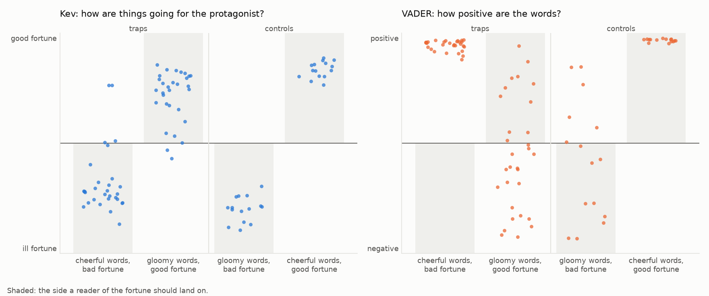
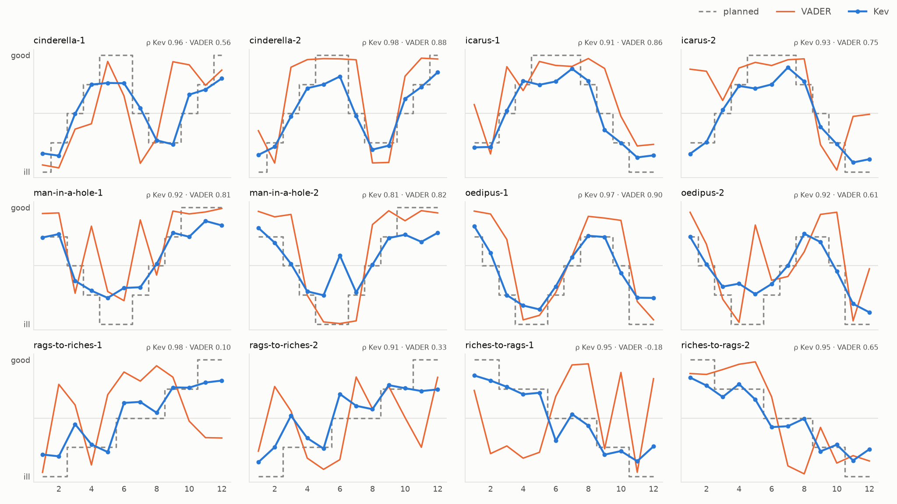

# Does the model read fortune, or only tone?

Model: Kev pointer head on Qwen/Qwen3.5-4B-Base, serving jaredpalmer/kev-4b at temperature 2.41. Baseline: VADER compound score. The criteria were fixed before the run (ALE-198).

| | Criterion | Result | |
|---|---|---|---|
| C1 | Kev reads the direction of fortune right on ≥ 75 % of tone traps | 90 % | ✅ |
| C2 | Kev and VADER are both right on ≥ 85 % of controls | 80 % (the lower of the two) | ❌ |
| C3 | Median Spearman ρ ≥ 0.8 on synthetic stories, and the right shape for ≥ 10 of 12 | ρ = 0.94, 12/12 shapes | ✅ |
| C4 | Renamed Romeo and Juliet correlates r ≥ 0.9 with the original, passage by passage | pending: the books have not been read again with the current questions | ⏳ |

## Tone traps

Standalone passages. In the traps, tone and fortune point opposite ways; in the controls they agree.

| Kind | n | Kev reads the fortune | VADER reads the fortune | Kev reads the tone | VADER matches the tone |
|---|---|---|---|---|---|
| cheerful-bad | 30 | 87 % | 0 % | 47 % | 100 % |
| gloomy-good | 30 | 93 % | 37 % | 57 % | 63 % |
| congruent-bad | 15 | 100 % | 60 % | 100 % | 60 % |
| congruent-good | 15 | 100 % | 100 % | 100 % | 100 % |

## Synthetic stories

Twelve stories, two per shape, written to a fortune level fixed in advance for each of their 12 passages.
Median Spearman ρ with the planned levels: Kev 0.94, VADER 0.70. Closest shape right: Kev 12/12, VADER 7/12.

| Story | Kev ρ | VADER ρ | Kev's shape | VADER's shape |
|---|---|---|---|---|
| cinderella-1 | 0.96 | 0.56 | cinderella | rags-to-riches ✗ |
| cinderella-2 | 0.98 | 0.88 | cinderella | cinderella |
| icarus-1 | 0.91 | 0.86 | icarus | icarus |
| icarus-2 | 0.93 | 0.75 | icarus | riches-to-rags ✗ |
| man-in-a-hole-1 | 0.92 | 0.81 | man-in-a-hole | man-in-a-hole |
| man-in-a-hole-2 | 0.81 | 0.82 | man-in-a-hole | man-in-a-hole |
| oedipus-1 | 0.97 | 0.90 | oedipus | oedipus |
| oedipus-2 | 0.92 | 0.61 | oedipus | oedipus |
| rags-to-riches-1 | 0.98 | 0.10 | rags-to-riches | icarus ✗ |
| rags-to-riches-2 | 0.91 | 0.33 | rags-to-riches | man-in-a-hole ✗ |
| riches-to-rags-1 | 0.95 | -0.18 | riches-to-rags | oedipus ✗ |
| riches-to-rags-2 | 0.95 | 0.65 | riches-to-rags | riches-to-rags |

## Renamed characters

*Not yet redone with the current questions: christmas-carol, metamorphosis, romeo-and-juliet, romeo-and-juliet-renamed still hold readings made with the first wording, so the numbers below and in the smoothing section are from that wording.*

*Romeo and Juliet* with every character and place renamed (Romeo → Tomas, Juliet → Clara, Verona → Tarsa…), read again and compared passage by passage: Pearson r = 0.89 over 124 passages.

Post hoc, not part of the criterion: the smoothed curves correlate r = 0.98, and the renamed reading is 0.14 lower on average (on a -1 to 1 scale). The famous names do not make the reading more tragic.

## Smoothing

Width of the Gaussian kernel chosen by leave-one-out cross-validation: each passage predicted from its neighbours.

| Book | Passages | Best σ (passages) | Share of the book |
|---|---|---|---|
| christmas-carol | 136 | 1 | 0.7 % |
| metamorphosis | 111 | 16 | 14.4 % |
| romeo-and-juliet | 124 | 1 | 0.8 % |

## Caveats

- The synthetic passages and traps were written to order by an LLM (Claude Sonnet), so they are probably more explicit than literature.
- Renaming leaves Shakespeare's verse recognisable: C4 tests whether names move the curve, not memory as a whole.
- One run of one model, in bf16 on a Mac (Kev reports probabilities within about 0.05 of its fp32 path).
